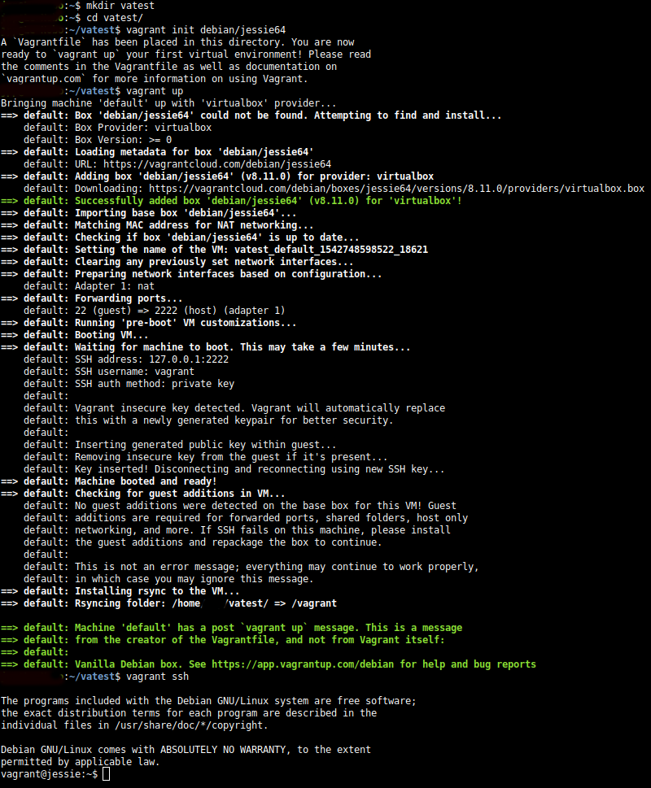

# Raportti h4

Tämän raportin tehtävissä on käytetty edellisistä tehtävistä tuttua Lenovon kannettavaa tietokonetta:


**Tietokoneen tiedot:**

* Koneen malli: Lenovo Z50-70
* CPU: Intel Core i5-4210U @ 4x 2.7GHz
* RAM: 16GB, 1600MHz DDR3
* GPU: Intel integrated graphics / nVidia GeForce 820
* Käyttöjärjestelmä: Xubuntu 18.04 LTS
* Lyvytila: noin 120GB (SSD), toinen vastaava osio varattu Windows 10 käyttöön


**Huom!**

Tehtäväksianto löytyy kohdassa h4 tästä linkistä; [terokarvinen.com](http://terokarvinen.com/2018/aikataulu-%e2%80%93-palvelinten-hallinta-ict4tn022-3004-ti-ja-3002-to-%e2%80%93-loppukevat-2018-5p) (tarkistettu viimeksi 20.11.2018):


Raportin koostaminen aloitettu 20.11.2018 klo. 11:08.

Tehtäviä on tehty osissa eri kellonaikoina samana päivänä, ajat pyritty merkkaamaan myös mahdollisimman tarkasti.


## Tehtäväksianto a)

a) Tee skripti, joka tekee koneestasi salt-orjan. **Lähde:** [terokarvinen.com](http://terokarvinen.com/2018/aikataulu-%e2%80%93-palvelinten-hallinta-ict4tn022-3004-ti-ja-3002-to-%e2%80%93-loppukevat-2018-5p)


Kasaamani skripti on tehty lähinnä omaan hyötykäyttöön, joten siinä on muutakin toiminnallisuutta mukana. Selitteet löytyvät koodin jälkeen.


Skriptiä on testattu ajaa ensin asteittain käsin, hyväksikäyttäen vagrant/virtualbox menetelmää ja sen jälkeen koottu shellscript tiedostoksi.

Uusin versio, johon voi tulla muutoksia vielä jatkossa, löytyy tästä linkistä: [start.sh](https://github.com/a1704565/salt/blob/master/start/start.sh)


Raportoinnin hetkellä noin klo. 11:30 tilanne näytti seuraavalta:

```Shell

#!/bin/bash
#Copyright 2018 Juha-Pekka Pulkkinen https://github.com/a1704565 GNU General Public License v3.0
#Based on work by Tero Karvinen:
#https://github.com/terokarvinen/sirotin/blob/master/run.sh
#http://terokarvinen.com/2018/salt-quickstart-salt-stack-master-and-slave-on-ubuntu-linux

echo "Running the start script! Please wait..."

setxkbmap fi
sudo apt-get update
sudo apt-get install -y salt-master salt-minion git
sudo timedatectl set-timezone Europe/Helsinki
sudo git clone https://github.com/a1704565/salt.git /srv/salt

git config --global user.email "juha-pekka.pulkkinen@myy.haaga-helia.fi"
git config --global user.name "Juha-Pekka Pulkkinen"
git config --global credential.helper "cache --timeout=3600"

echo -e 'master: localhost\nid: labrabuntu'|sudo tee /etc/salt/minion

sudo systemctl restart salt-minion.service
sleep 5s
sudo salt-key -yA

echo "Start script completed... You can start working now!"

```

**Skriptin selite:**

* echo komennolla ilmoitetaan skriptin käyttäjälle, että prosessi on lähtenyt käyntiin.
* setxkmap fi määrittää käytettävän koneen näppäimistön suomeksi.
* apt-get komento päivittää listan ja seuraava apt-get asentaat salt-master ja salt-minion ohjelmistot.
* timedatectl avulla laitetaan aikavyöhyke oikeaksi.
* git clone komennolla kloonataan salt repository polkuun /srv/salt 
* git config komennoilla ajetaan perus konfiguraatiot kohdalleen omia tarkoituksiani varten
	* määritetty käyttäjän sähköposti
	* määritetty käyttäjän nimi
	* määritys että git ei kysele salasanaa liian useasti
* echo ja tee komennoilla ajetaan salt masterin tiedot oikeaan kansioon (master on tässä oma minioninsa)
* systemctl restart komennolla käynnistetään uudestaan tarvittava palvelu
* sleep komento laittaa skriptin odottamaan 5 sekuntia, jotta edellinen toiminto ehtii suorittautua loppuun.
* salt-key -yA hyväksyy automaattisesti minionin
* viimeinen echo kertoo, että homma on valmis.


**Testausmenetelmä:**

Kyseistä skriptiä on ajettu useaan kertaan eri vaiheissa, käyttäen vagrant cloudista löytyvää **bento/ubuntu-16.04 vagrant boxia**, suora linkki: [vagrantup.com](https://app.vagrantup.com/bento/boxes/ubuntu-16.04).

Koneelle oli valmiiksi asennettuna vagrant ja virtualbox, mutta kertauksen vuoksi ne ovat asennettavissa seuraavilla komennoilla:

```Shell
sudo apt-get update
sudo apt-get -y install vagrant virtualbox
```

Vagrant otettu käyttöön käyttäjän home-kansiossa seuraavalla menetelmällä.

```Shell
mkdir vagr
cd vagr/
vagrant init bento/ubuntu-16.04
vagrant up
vagrant ssh
```

Vagrant ssh-toimintoa hyödyntäen ladattu vagrantille githubiin puskettu versio tuosta start.sh skriptistä ja ajettu se bash komennolla.

```Shell
wget https://raw.githubusercontent.com/a1704565/salt/master/start/start.sh
bash start.sh
```

**Huomioitavaa:**

1. Aluksi testaus tuotti virheen liittyen salt-key kohtaan, mutta ongelma korjaantui lisäämällä skriptiin tuo 5 sekunnin viive ennen kyseistä toimintoa.

Tehtävien teko keskeytyi noin klo. 12:25

Tehtävien tekoa jatkettu noin klo. 22:20

2. setxkbmap fi ja timedatectl tuottivat virheitä myös, mutta tilanne kokeiltu boottaamalla USB-tikulta live versio Xubuntu 18.04 LTS ja ajamalla sama testi sillä. Kaikki toimi oikein, joten ongelma liittyi jotenkin virtualisoituun ympäristöön. Muutettu kuitenkin lopullista skriptiä lisäämällä toinen lyhyempi viive aikaisempaan vaiheeseen, sekä siirtämällä timedatectl aikaisemmaksi skriptissä.

Fyysisen testikoneen tiedot:
* CPU: Intel Core i5-4460 @ 4x 3.4GHz
* GPU: nVidia GeForce GTX 1060 6GB
* RAM: 16GB, 1600MHz DDR3

**Lopullinen toimivaksi testattu scripti:**
```Shell
#!/bin/bash
#Copyright 2018 Juha-Pekka Pulkkinen https://github.com/a1704565 GNU General Public License v3.0
#Based on work by Tero Karvinen; https://github.com/terokarvinen/sirotin/blob/master/run.sh & http://terokarvinen.com/2018/salt-quickstart-salt-stack-master-and-slave-on-ubuntu-linux

echo "Running the start script! Please wait..."

setxkbmap fi
sudo timedatectl set-timezone Europe/Helsinki
sleep 2s
sudo apt-get update
sudo apt-get install -y salt-master salt-minion git
sudo git clone https://github.com/a1704565/salt.git /srv/salt

git config --global user.email "juha-pekka.pulkkinen@myy.haaga-helia.fi"
git config --global user.name "Juha-Pekka Pulkkinen"
git config --global credential.helper "cache --timeout=3600"

echo -e 'master: localhost\nid: labrabuntu'|sudo tee /etc/salt/minion

sudo systemctl restart salt-minion.service
sleep 5s
sudo salt-key -yA

echo "Start script completed... You can start working now!"

```

Tehtävän teko lopetettu 23:00


## Tehtäväksianto c)

Tee joko b tai c:

b) Lokianalytiikka. Kokeile viimeisintä versiota Jussin, Einon ja Sakun lokien analytiikasta. Täytä tai kommentoi GitHub-sivulla jotain bugia tai kehitysehdotusta. (Jos teit tätä tunnilla, tee uusi bugiraportti/kommentti uusimmasta versiosta) https://github.com/jisosomppi/log-analysis/tree/master/salt

c) Vagrant. Asenna Vagrant. Kokeile jotain uutta kuvaa Atlaksesta. Huomaa, että kuvat ovat vieraita binäärejä, ja virtuaalikoneista on mahdollista murtautua ulos. Jokohan Ubuntun virallinen  Suodatin: VirtualBox, järjestys: Most downloads. https://app.vagrantup.com/boxes/search?provider=virtualbox. 

**Lähde:** [terokarvinen.com](http://terokarvinen.com/2018/aikataulu-%e2%80%93-palvelinten-hallinta-ict4tn022-3004-ti-ja-3002-to-%e2%80%93-loppukevat-2018-5p)


Tehtävä aloitettu klo. 23:05

Tehtävä c) aloitettu selaamalla tehtävänannossa esiintynyttä sivustoa ja luomalla kansio vatest käyttäjän kotikansioon. Vagrant ja virtualbox ovat jo asennettu konelle, tehtävässä a) käyty jo läpi tämä vaihe.

Valittu uudeksi kuvaksi kokeiluun debian/jessie64. [Linkki](https://app.vagrantup.com/debian/boxes/jessie64)


```Shell
mkdir vatest
cd vatest/
vagrant init debian/jessie64
vagrant ssh

vagrant@jessie:~$
```
Kuva tilanteesta:


SSH-yhteys toimi normaalisti, joten päätin testata Debianilla päivitysten ajamista. Sekä tuota tehtäväss a) luotua skriptiä.

```Shell
sudo apt-get update
sudo apt-get upgrade

wget https://raw.githubusercontent.com/a1704565/salt/master/start/start.sh
bash start.sh
```

Kaikki toimi tähän asti normaalisti. Testattu tässä vaiheessa vielä ajaa salt-komento.

```Shell
vagrant@jessie:~$ sudo salt '*' cmd.run 'whoami'
labrabuntu:
    root
```

Myös tämä testi toimi.

Vagrantin pysäytys ja virtuaalikoneen tuhoaminen.

```Shell
vagrant@jessie:~$ exit
logout
Connection to 127.0.0.1 closed.

/vatest$ vagrant halt
==> default: Attempting graceful shutdown of VM...
/vatest$ vagrant destroy
    default: Are you sure you want to destroy the 'default' VM? [y/N] 
==> default: Destroying VM and associated drives...

```

Tehtävän teko lopetettu 23:45

---
# Lähdeluettelo

1. Tero Karvinen: [terokarvinen.com](http://terokarvinen.com/2018/aikataulu-%e2%80%93-palvelinten-hallinta-ict4tn022-3004-ti-ja-3002-to-%e2%80%93-loppukevat-2018-5p)
