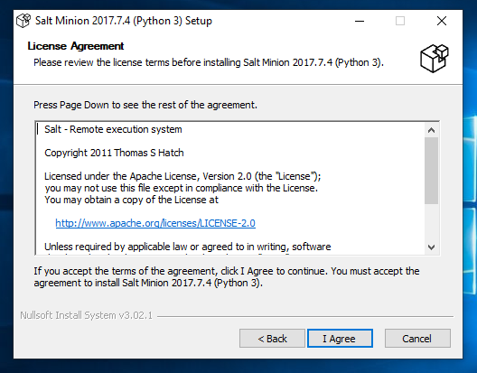

# Raportti h5

Copyright 2018 Juha-Pekka Pulkkinen [https://github.com/a1704565](https://github.com/a1704565) GNU General Public License v3.0

**Raportoitavissa tehtävissä käytettyjen tietokoneiden tiedot:**

**Master:**

Lenovon kannettava tietokone, jota on käytetty aikaisemmissakin tehtävissä.

_Koneen tiedot:_

* Koneen malli: Lenovo Z50-70
* CPU: Intel Core i5-4210U @ 4x 2.7GHz
* RAM: 16GB, 1600MHz DDR3
* GPU: Intel integrated graphics / nVidia GeForce 820
* Käyttöjärjestelmä: Xubuntu 18.04 LTS
* Lyvytila: noin 120GB (SSD), toinen vastaava osio varattu Windows 10 käyttöön

**Minion:**

Pöytäkone on koottu komponenteista, eli se ei ole mikään merkkikone. Kyseisellä koneella on kesken monta muuta projektia, joten päädyin käyttämään kyseisellä koneella vivirtuaalista Windows 10 asennusta toistaiseksi, kunnes saan muut projektit hoidettua alta pois.

_Fyysisen koneen tiedot:_

* CPU: Intel Core i5-4460 @ 4x 3.2GHz
* Emolevy: Asus Z97M-PLUS, LGA 1150 (BIOS date 02/22/2016)
* RAM: 16GB, 1600MHz (timing 10-10-10-27) DDR3
* GPU: Asus nVidia GeForce GTX 1060 6GB
* Käyttöjärjestelmä: Windows 10 Pro (versio 1803)
* Lyvytila: 500GB SSD

_Virtuaalikoneen tiedot:_

* Ympäristö: Oracle VM VirtualBox 5.2.22 r126460 (Qt5.6.2) + Oracle VM VirtualBox Extention Pack 5.2.22
* CPU: Intel Core i5-4460 @ 2x 3.2GHz - PAE/NX kytketty päälle, sekä VT-x/AMD-V + Nested Paging
* RAM: 8GB
* Videomuistia: 256MB, 2D ja 3D kiihdytys kytketty päälle
* Käyttöjärjestelmä: Windows 10 Home (versio 1809)
* Lyvytila: dynaaminen virtuaalikovalevy (formaatti=VDI) 50GB (sallittu virtuaalikoneen nähdä levy SSD:nä)
* Verkkoadapteri: Siltaavassa tilassa (bridged)


Raportoinnissa viittaukset Lenovoon = Master ja viittaukset W10 = minion.


**Huom!**

Tehtäväksianto löytyy kohdassa h5 tästä linkistä; [terokarvinen.com](http://terokarvinen.com/2018/aikataulu-%e2%80%93-palvelinten-hallinta-ict4tn022-3004-ti-ja-3002-to-%e2%80%93-loppukevat-2018-5p) (tarkistettu viimeksi 28.11.2018)


Tehtävien työstäminen aloitettu 28.11.2018 klo. 16:50.

## Tehtäväksianto a)

a) Säädä Windowsia Saltilla siten, että Windows on orja ja Linux on herra. **Lähde:** [terokarvinen.com](http://terokarvinen.com/2018/aikataulu-%e2%80%93-palvelinten-hallinta-ict4tn022-3004-ti-ja-3002-to-%e2%80%93-loppukevat-2018-5p)

Selvitetty aluksi mikä versio Saltista on käytössä Master koneella (Lenovo)

```Shell

Lenovo$ salt --version
salt 2017.7.4 (Nitrogen)

```
Versio on 2017.7.4, joten seuraava vaihe on asentaa sama versio Windows 10 virtuaalikoneelle. Winsows repository löytyy kätevästi osoitteesta [https://repo.saltstack.com/windows/](https://repo.saltstack.com/windows/). Parhaiten yhteensopiva versio tässä tapauksessa on _Salt-Minion-2017.7.4-Py3-AMD64-Setup.exe_.

Kuvankaappaus vaihtoehdoista:


Tiedoston lataamisen jälkeen prosessi eteni seuraavasti w10 koneella:


Avataan/suoritetaan ladattu tiedosto.


Mikäli Windows 10 antaa User Access Control (UAC) varoituksen ja tarjoaa no vaihtoehtoa, mutta oikea vaihtoehto on yes.


Asennusohjelma kertoo mitä olet asentamassa, valitaan next.



Seuraavaksi esitetään lisenssisopimus, joka tulee hyväksyä ennen varsinaista asennusta.


Oletuksena asennusohjelma kysyy Masterin IP-osoitetta tai Hostnamea.

Tässä vaiheessa tarkistettu, masterin IP-osoite:

```Shell
Lenovo$ hostname -I
192.168.0.131 

```


Syötetty tässä vaiheessa oikeat tiedot kenttiin.


Asennusohjelma saattaa ilmoittaa tarvittavasta VC_Redist_2015 paketista ja sen asennus tulee hyväksyä tässä vaiheesas, jotta salt toimisi oikein.


Asennusprosessin lopuksi pitää varmistaa, että rasti on ruudussa _Start salt-minion_, jonka jälkeen asennusohjel voidaan sulkea.


Asennuksen jälkeen tarkistin master koneella, että salt-key listaan ilmestyy tuo w10, jonka jälkeen hyväksyin sen minuoniksi.

```Shell
Lenovo$ sudo salt-key -L
Accepted Keys:
Denied Keys:
Unaccepted Keys:
w10
Rejected Keys:


Lnovo$ sudo salt-key -A
The following keys are going to be accepted:
Unaccepted Keys:
w10
Proceed? [n/Y] y
Key for minion w10 accepted.
```


**Testaus:**

```Shell
Lenovo$ sudo salt '*' test.ping
w10:
    True

Lenovo$ sudo sudo salt '*' cmd.run 'ipconfig'
w10:
    
    Windows IP Configuration
    
    
    Ethernet adapter Ethernet:
    
       Connection-specific DNS Suffix  . : 
       Link-local IPv6 Address . . . . . : fe80::a0b9:xxx:xxxx:xxxxxx
       IPv4 Address. . . . . . . . . . . : 192.168.0.109
       Subnet Mask . . . . . . . . . . . : 255.255.255.0
       Default Gateway . . . . . . . . . : 192.168.0.1
```

Testaustatut komennot näyttävät toimivan ja palauttaa w10 minionilta vastauksia, kuten pitääkin.


**Ohjelmien asentaminen**

Seuraava vaihe pohjautuu Tero Karvisen artikkeliin [Control Windows with Salt](http://terokarvinen.com/2018/control-windows-with-salt)

Master koneella tehtävät toimenpiteet:

```Shell
Lenovo$ sudo mkdir /srv/salt/win
Lenovo$ sudo chown root.salt /srv/salt/win
Lenovo$ sudo chmod ug+rwx /srv/salt/win
Lenovo$ sudo salt-run winrepo.update_git_repos
Lenovo$ sudo salt -G 'os:windows' pkg.refresh_db
w10:
    Minion did not return. [No response]
Lenovo$ sudo salt '*' pkg.install vlc
w10:
    Minion did not return. [No response]
Lenovo$ sudo salt '*' pkg.install firefox
w10:
    Minion did not return. [No response]
```

En tiedä mistä syystä tuo "minion did not return" ilmoitus johtuu, mutta kaikki ohjelmat asentuvat silti virtuaalikoneelle ilman ongelmia. Epäilen että tässä saattaa olla syynä se, että käytän virtuaalikonetta.


## Tehtäväksianto b)

b) Säädä Windowsia Saltilla ilman herra-orja rakennetta (salt-call --local). **Lähde:** [terokarvinen.com](http://terokarvinen.com/2018/aikataulu-%e2%80%93-palvelinten-hallinta-ict4tn022-3004-ti-ja-3002-to-%e2%80%93-loppukevat-2018-5p)

```PowerShell
Windows PowerShell
Copyright (C) Microsoft Corporation. All rights reserved.

PS C:\Windows\system32> cd..
PS C:\Windows> cd..
PS C:\> cd .\salt\
PS C:\salt> dir


    Directory: C:\salt


Mode                LastWriteTime         Length Name
----                -------------         ------ ----
d-----       11/28/2018   6:59 PM                bin
d-----       11/28/2018   7:00 PM                conf
d-----       11/28/2018   6:59 PM                var
-a----         1/4/2018   7:40 PM         294912 nssm.exe
-a----         1/4/2018   7:40 PM            308 salt-call.bat
-a----         1/4/2018   7:40 PM            306 salt-cp.bat
-a----         1/4/2018   7:40 PM            373 salt-minion-debug.bat
-a----         1/4/2018   7:40 PM             57 salt-minion-start-service.bat
-a----         1/4/2018   7:40 PM            310 salt-minion.bat
-a----         1/4/2018   7:40 PM         143185 salt.ico
-a----       11/28/2018   6:59 PM         192213 uninst.exe


PS C:\salt> .\salt-call.bat --local test.ping
local:
    True
PS C:\salt> .\salt-call.bat --local pkg.install git
[WARNING ] C:\salt\bin\lib\site-packages\salt\modules\win_update.py:91: DeprecationWarning: The 'win_update' module is being deprecated and will be removed in Salt Fluorine (Unreleased). Please use the 'win_wua' module instead.

local:
    ----------
    git:
        ----------
        new:
            2.19.1
        old:
PS C:\salt>
```


## Tehtäväksianto c)

c) Muuta jonkin Windows-ohjelman asetuksia Saltilla. Monia ohjelmia voi säätää laittamalla asetustiedoston paikalleen, aivan kuten Linuxissa. **Lähde:** [terokarvinen.com](http://terokarvinen.com/2018/aikataulu-%e2%80%93-palvelinten-hallinta-ict4tn022-3004-ti-ja-3002-to-%e2%80%93-loppukevat-2018-5p)


## Tehtäväksianto d)

d) Valitse aihe omaksi kurssityöksi ja varaa se kommenttina aikataulusivun perään. **Lähde:** [terokarvinen.com](http://terokarvinen.com/2018/aikataulu-%e2%80%93-palvelinten-hallinta-ict4tn022-3004-ti-ja-3002-to-%e2%80%93-loppukevat-2018-5p)


## Tehtäväksianto e)

e) Vapaaehtoinen: tee omaan käytössä olevaan (Windows, jos käytät Windowsia) koneeseesi Saltilla jokin säätö, josta on sinulle hyötyä jokapäiväisessä elämässä. **Lähde:** [terokarvinen.com](http://terokarvinen.com/2018/aikataulu-%e2%80%93-palvelinten-hallinta-ict4tn022-3004-ti-ja-3002-to-%e2%80%93-loppukevat-2018-5p)


---

# Lähdeluettelo

1. http://terokarvinen.com/2018/aikataulu-%e2%80%93-palvelinten-hallinta-ict4tn022-3004-ti-ja-3002-to-%e2%80%93-loppukevat-2018-5p
2. http://terokarvinen.com/2018/control-windows-with-salt