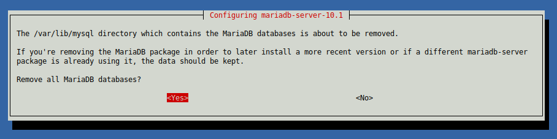

# Raportti h6

Copyright 2018 Juha-Pekka Pulkkinen [https://github.com/a1704565](https://github.com/a1704565) GNU General Public License v3.0

**Raportoitavissa tehtävissä käytettyjen tietokoneiden tiedot:**

**Master:**

Lenovon kannettava tietokone, jota on käytetty aikaisemmissakin tehtävissä.

_Koneen tiedot:_

* Koneen malli: Lenovo Z50-70
* CPU: Intel Core i5-4210U @ 4x 2.7GHz
* RAM: 16GB, 1600MHz DDR3
* GPU: Intel integrated graphics / nVidia GeForce 820
* Käyttöjärjestelmä: Xubuntu 18.04 LTS
* Lyvytila: noin 120GB (SSD), toinen vastaava osio varattu Windows 10 käyttöön

**Minion**

Itse kasattu pöytäkone, jossa asennettuna Windows 10 Pro, mutta nyt bootattu live-tikulla, jossa Xubuntu 18.04.01 LTS.

_Koneen tieddot:_

* CPU: Intel Core i5-4460 @ 4x 3.2GHz
* Emolevy: Asus Z97M-PLUS, LGA 1150 (BIOS date 02/22/2016)
* RAM: 16GB, 1600MHz (timing 10-10-10-27) DDR3
* GPU: Asus nVidia GeForce GTX 1060 6GB
* Käyttöjärjestelmä: USB-tikulta käynnistetty Xubuntu 18.04.01 LTS
* Lyvytila: 500GB SSD

Master = Lenovo

Minion = labrabuntu

---

Tehtäväksianto löytyy kohdassa h6 tästä linkistä; [terokarvinen.com](http://terokarvinen.com/2018/aikataulu--palvelinten-hallinta-ict4tn022-3004-ti-ja-3002-to--loppukevat-2018-5p) (tarkistettu viimeksi 4.12.2018)

---

## Tehtäväksianto

Asenna LAMP Saltilla.


**Taustatiedot**

Tehtävän tekeminen aloitettu: _klo. 6:38 4.12.2018_

Labrabuntu kone on määritetty tässä vaiheessa minioniksi koneelle Lenovo.

Minulla oli jo omassa gituhubissa jossain vaiheessa testailuun luomani salt-tila [lamp.sls](https://github.com/a1704565/salt/blob/master/lamp-old.sls), jota muokkaamalla lähdin toetuttamaan tehtävää. Uusin versio löytyy [täältä](https://github.com/a1704565/salt/blob/master/lamp.sls).

**Muokattu lamp.sls:**

```SlatStack
apache2:
  pkg.installed

/var/www/html/index.html:
  file.managed:
    - source: salt://www/index.html

/etc/apache2/mods-enabled/userdir.conf:
  file.symlink:
    - target: ../mods-available/userdir.conf

/etc/apache2/mods-enabled/userdir.load:
  file.symlink:
    - target: ../mods-available/userdir.load

apache2service:
  service.running:
    - name: apache2
    - watch:
      - file: /etc/apache2/mods-enabled/userdir.conf
      - file: /etc/apache2/mods-enabled/userdir.load

mariadb:
  pkg.installed:
    - pkgs:
      - mariadb-server
      - mariadb-client

php:
  pkg.installed
```

**Selitteet:**

- Asennetaan apache2
- Haetaan Masterin salt kansiosta index.html sisältö ja viedään se Minionin polkuun /var/www/html/index.html
- Otetaan käyttöön userdir ominaisuus apachessa, luomalla symbooliset linkit tarpeellisiin kansioihin
- käynnistetään uudestaan apachen palvelu, mikäli valvottavat kohteet userdit.conf tai userdi.load ovat muuttuneet
- asennetaan mariadb client ja server
- asennetaan php

**Testaus:**

Ajettu ensin lamp.sls salt-tila.

```Shell
Lenovo$ sudo salt '*' state.apply lamp

Summary for labrabuntu
------------
Succeeded: 7 (changed=7)
Failed:    0
------------
Total states run:     7
Total run time:  56.154 s
```

Testattu curlilla, että minionin IP-osoitteessa sivusto (index.html) toimii ja asetukset ovat siis vaihtuneet.

```Shell
Lenovo$ curl 192.168.0.101
<!DOCTYPE html>
<html>
<body>

<h1>Salt minion test</h1>

<p>test!</p>

</body>
</html>
```

Viimeisenä testattu userdir toimivuus minionilla, luomalla ensin sisältö tätä tarkoitusta varten.

```Shell
labrabuntu$ mkdir public_html
labrabuntu$ cd public_html
labrabuntu$ echo asd > index.html
labrabuntu$ cat index.html
asd
```

Curl-testi minionin IP-osoite/käyttäjä/index.html

```Shell
Lenovo$ curl 192.168.0.101/~user/index.html
asd
```

Tässä vaiheessa kaikki hyvin ja homma toimii.

_tehtävän tekeminen lopetettu: klo 7:56 4.12.2018_

---

_Edeltävän parantelu aloitettu klo. 17:43 4.12.2018_


**Mietteet:**

Edeltävän tilan toiminnallisuutta voisi parantaa entisestään, lisäämällä Mariadb:hen tietokannan ja käyttäjän ihan testimielessä, vaikka tehtäväksiannossa tätä kohtaa ei mainitakaan suoranaisesti.

**huom!** Tämä ei välttämättä ole turvallista toteuttaa näin oikeassa 

Salt-tilan ajamisen jälkeen ajettu manuaalisesti nämä komennot minionilla:

```Shell
labrabuntu$ sudo mariadb -u root
MariaDB [(none)]> CREATE DATABASE minion;
Query OK, 1 row affected (0.00 sec)
MariaDB [(none)]> GRANT ALL ON minion.* TO minionuser@localhost IDENTIFIED BY 'jotjH_goeYER-83jtej2-insert-better-password';
Query OK, 0 rows affected (0.00 sec)
```
Selite:

- kirjaututaan sisään mariadb:hen
- lisätään tietokanta nimeltä minion
- lisätään luotuun tietokantaan kaikki oikeudet käyttäjälle minionuser (samalla komento luo tämän käyttäjän), käyttäjä tunnistautuu salasanalla (tässä se on vain esimerkki)

**Manuaalisesti ajetun tilanteen tarkastus:**

```Shell
MariaDB [(none)]> SHOW DATABASES;
+--------------------+
| Database           |
+--------------------+
| information_schema |
| minion             |
| mysql              |
| performance_schema |
+--------------------+
4 rows in set (0.00 sec)

MariaDB [(none)]> SHOW GRANTS FOR minionuser@localhost;
+-------------------------------------------------------------------------------------------------------------------+
| Grants for minionuser@localhost                                                                                   |
+-------------------------------------------------------------------------------------------------------------------+
| GRANT USAGE ON *.* TO 'minionuser'@'localhost' IDENTIFIED BY PASSWORD '*B249F4C28C9DE0CAA7053861C552140668DF9C9C' |
| GRANT ALL PRIVILEGES ON `minion`.* TO 'minionuser'@'localhost'                                                    |
+-------------------------------------------------------------------------------------------------------------------+
2 rows in set (0.00 sec)

MariaDB [(none)]> EXIT;
Bye
```
Selite:

- Tarkastettu tietokannat. Minion näkyy listalla, joten kaikki ok
- Tarkastettu oikeudet, komento näyttää myös samalla käyttäjän, joten kaikki myös ok
- Poistuttu mariadb:stä exit komennolla

Poistettu tässä vaiheessa mariadb client ja server, sekä luodut teitokannat yms.

    sudo apt-get -y autoremove --purge mariadb-client
    sudo apt-get -y autoremove --purge mariadb-server




**Automaation luominen:**

Loin ensin ShellScriptin (database.sh), joka tekee tarvittavat toimenpiteet, jonka jälkeen otin selvää saltin [manuaalista](https://docs.saltstack.com/en/latest/ref/states/all/salt.states.cmd.html), kuinka voin juoksuttaa sen vain kerran, ettei operaatiota toisteta turhaan useasti, jos tietokanta ja käyttäjä on jo kerran luotu. Tähän löytyi monta eri tatkaisua ja päädyin niistä itselle helpoimpaan vaihtoehtoon (selostus alempana).

```Shell
#!/bin/bash
echo "CREATE DATABASE minion;" | sudo mariadb -u root
echo "GRANT ALL ON minion.* TO minionuser@localhost IDENTIFIED BY 'jotjH_goeYER-83jtej2-insert-better-password';" | sudo mariadb -u $
echo "database for testing purposes has been created" | sudo tee /etc/mysql/done.log
```
**Vaiheet:**

- ensin luodaan echoa käyttäen mariadb:hen database nimeltä minion
- seuraavaksi luodaan käyttäjä, jolla on oikeudet tietokantaan ja tunnistautuminen käy salasanalla
- viimeisenä luodaan done.log teidosto, jota käytetään myöhemmässä vaiheessa hyödyksi tunnistamaan, onko komennot jo ajettu vai ei

Kyseinen database.sh on tallennettu polkuun `/srv/salt/www` ja sen omistajuus on muutettu saltille `sudo chown salt database.sh`, sen oikeudet on myös muutettu `sudo chmod 400 database.sh`. Tämä tarkoittaa, että vain omistajalla eli saltilla on lukuoikeus tiedostoon ja muilla ei ole oikeuksia tiedostoon.

Muutosten testaus:

```Shell
Lenovo$ ls -l /srv/salt/www/database.sh 
-r-------- 1 salt root 288 joulu  4 19:22 /srv/salt/www/database.sh

Lenovo$ cat /srv/salt/www/database.sh 
cat: /srv/salt/www/database.sh: Permission denied
```


**Päivitetty versio tiedostosta lamp.sls**

```YAML
apache2:
  pkg.installed

/var/www/html/index.html:
  file.managed:
    - source: salt://www/index.html

/etc/apache2/mods-enabled/userdir.conf:
  file.symlink:
    - target: ../mods-available/userdir.conf

/etc/apache2/mods-enabled/userdir.load:
  file.symlink:
    - target: ../mods-available/userdir.load

apache2service:
  service.running:
    - name: apache2
    - watch:
      - file: /etc/apache2/mods-enabled/userdir.conf
      - file: /etc/apache2/mods-enabled/userdir.load

mariadb:
  pkg.installed:
    - pkgs:
      - mariadb-server
      - mariadb-client

database:
  cmd.script:
    - name: database.sh
    - source: salt://www/database.sh
    - creates:
      - /etc/mysql/done.log

php:
  pkg.installed
```

**Seloste lisätystä vaiheesta database:**

- cmd.script komennolla ajetaan läpi luotu skripti
- name määrittää ajettavan skriptin nimen
- source määrittää missä tiedosto sijaitsee (tässä tapauksessa se on saltin alakansiossa www)
- creates määrittää, että skripti luo tiedoston polkuun /etc/mysql/done.log ja mikäli salt-tila ajetaan uudestaan skriptiä ei ajeta, koska kyseinen .log tiedosto on jo olemassa. Salt siis päättelee asian logiikalla "koska done.log = olemassa, kaikka tarvittavat tiedostot on jo luotu"

**Testaus**

Ajetaan salt-tila ensimmäisen kerran:

```Shell
Lenovo$ sudo salt '*' state.apply lamp

###
----------
          ID: database
    Function: cmd.script
        Name: database.sh
      Result: True
     Comment: Command 'database.sh' run
     Started: 20:01:40.974556
    Duration: 83.778 ms
     Changes:   
              ----------
              pid:
                  31796
              retcode:
                  0
              stderr:
              stdout:
                  database for testing purposes has been created
----------

###

Summary for labrabuntu
------------
Succeeded: 8 (changed=8)
Failed:    0
------------
Total states run:     8
Total run time:  41.315 
```
Ajetaan salt-tila uudestaan, jolloin mitään ei pitäisi muuttua:

```Shell
Lenovo$ sudo salt '*' state.apply lamp
labrabuntu:
----------
          ID: apache2
    Function: pkg.installed
      Result: True
     Comment: All specified packages are already installed
     Started: 20:46:54.465489
    Duration: 365.623 ms
     Changes:   
----------
          ID: /var/www/html/index.html
    Function: file.managed
      Result: True
     Comment: File /var/www/html/index.html is in the correct state
     Started: 20:46:54.833493
    Duration: 131.971 ms
     Changes:   
----------
          ID: /etc/apache2/mods-enabled/userdir.conf
    Function: file.symlink
      Result: True
     Comment: Symlink /etc/apache2/mods-enabled/userdir.conf is present and owned by root:root
     Started: 20:46:54.965638
    Duration: 1.69 ms
     Changes:   
----------
          ID: /etc/apache2/mods-enabled/userdir.load
    Function: file.symlink
      Result: True
     Comment: Symlink /etc/apache2/mods-enabled/userdir.load is present and owned by root:root
     Started: 20:46:54.967448
    Duration: 1.474 ms
     Changes:   
----------
          ID: apache2service
    Function: service.running
        Name: apache2
      Result: True
     Comment: The service apache2 is already running
     Started: 20:46:54.970634
    Duration: 34.073 ms
     Changes:   
----------
          ID: mariadb
    Function: pkg.installed
      Result: True
     Comment: All specified packages are already installed
     Started: 20:46:55.004904
    Duration: 4.644 ms
     Changes:   
----------
          ID: database
    Function: cmd.script
        Name: database.sh
      Result: True
     Comment: All files in creates exist
     Started: 20:46:55.010744
    Duration: 0.467 ms
     Changes:   
----------
          ID: php
    Function: pkg.installed
      Result: True
     Comment: All specified packages are already installed
     Started: 20:46:55.011293
    Duration: 2.88 ms
     Changes:   

Summary for labrabuntu
------------
Succeeded: 8
Failed:    0
------------
Total states run:     8
Total run time: 542.822 ms
```

Tulos näyttäisi olevan odotetun mukainen, ja kaikki toimii kuten pitääkin, sillä database kohta ilmoittaa _"Comment: All files in creates exist"_

_parantelu lopetettu klo. 20:48_